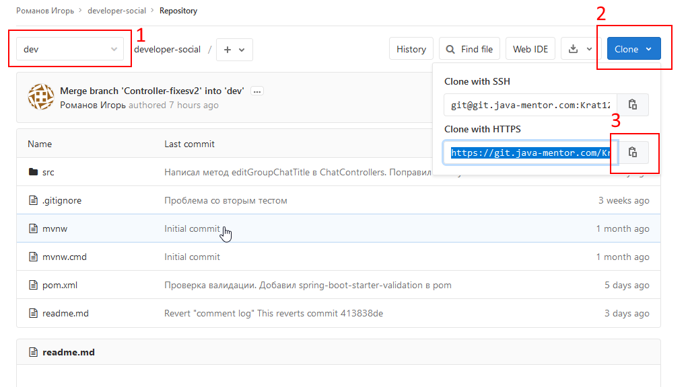
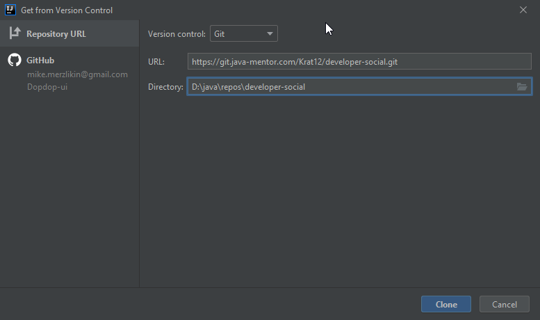
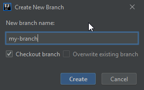
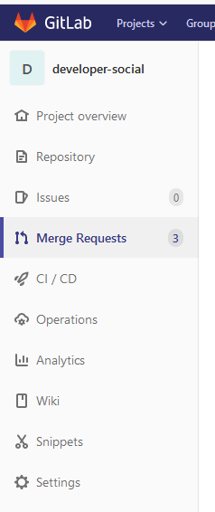
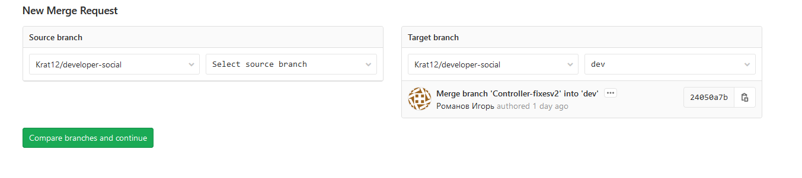
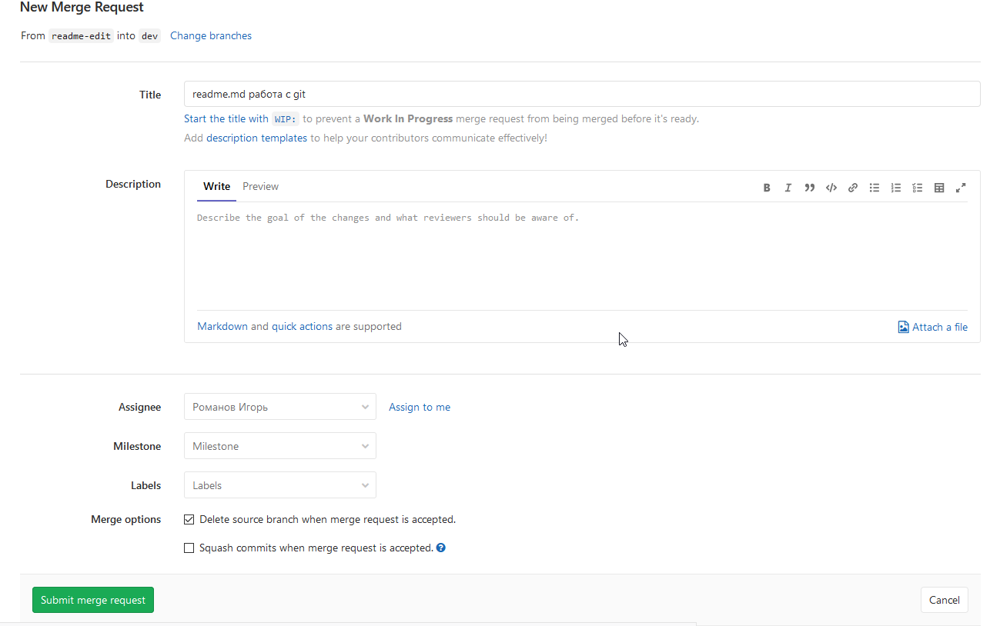
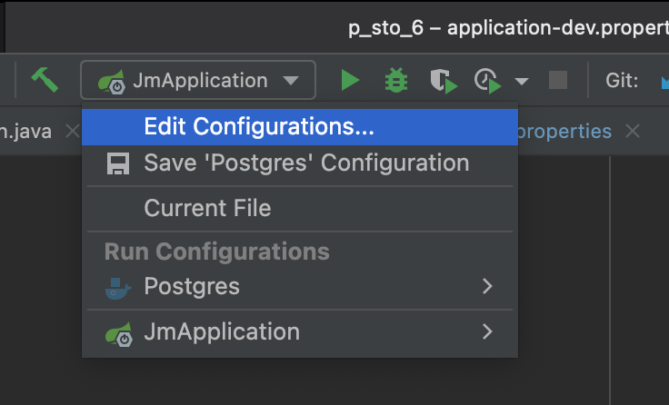
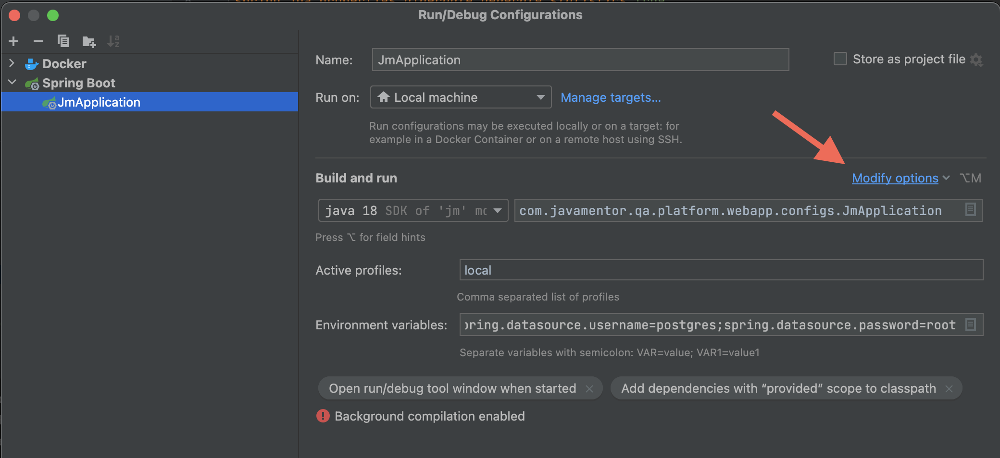
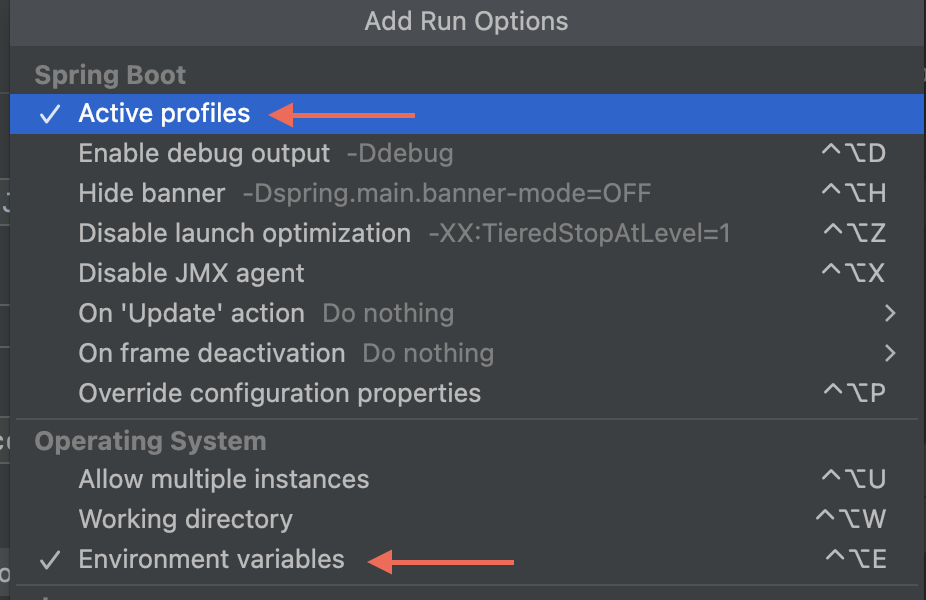
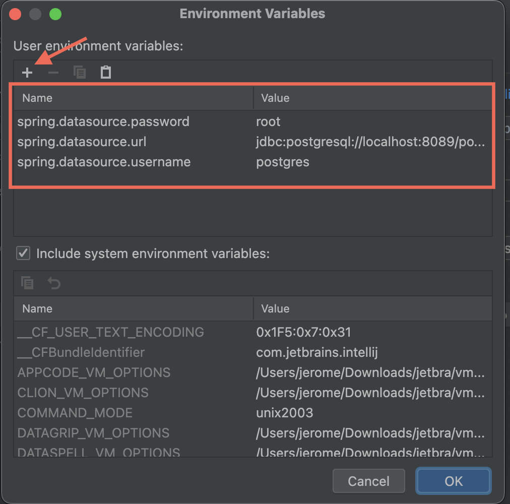

# Документация JMStack
## Работа c git
### Клонирование проекта

1. На странице репозитория убедитесь, что выбрана ветка **dev** (1), нажмите кнопку **Clone** (2), скопируйте ссылку (3).



2. Откройте **Intellij IDEA**, нажмите **Get from version control** на экране приветствия, либо **VCS | Git | Clone...** в меню.


3. Вставьте скопированную ссылку в строку **URL**, нажмите **Clone**.



### Перед внесением изменений в код
Создайте новую ветку в git-репозитории и работайте в ней. Для этого:
1. Нажмите на текущую ветку **dev** в правом нижнем углу.


2. Выберите **New branch**.


3. Введите название своей новой ветки (на ваше усмотрение) и нажмите **Create**.



### Добавление своего кода в общий репозиторий. Git push.

Прежде чем создать merge request вам необходимо подготовить вашу ветку к отправке в общий репозиторий.

1. Нажмите на текущую ветку в правом нижнем углу. Выберите опцию **dev | update**. 
Таким образом вы скачаете в свою локальную ветку **dev** все коммиты которые были замержены, 
пока вы работали в своей ветке.


2. Убедитесь, что в данный момент активна ваша рабочая ветка (занчек ярлыка слева от имени, как у ветки my-branch на скриншоте).
Выберите опцию **dev | Merge into Current**. Таким образом вы добавите все изменения из ветки **dev** в вашу ветку. При возникновении конфликтов разрешите их.


3. ---**ВАЖНО**--- Убедитесь что проект собирается и запускается.

4. Выберите вашу ветку и нажмите на **Push...**, чтобы добавить её в общий репозиторий.


### Создание merge request

1. Создайте новый merge request. В качестве **Source branch** выберите свою ветку, **Target branch** - **dev**.






2. Проверьте данные, допишите комментарии при необходимости. Обратите внимание на опцию **Delete source branch when merge request is accepted**.
Завершите создание реквеста, приложите ссылку на него в карточку таска на Trello.




## Сущности

### User

#### Поля:

- **id** - уникальный идентификационный номер пользователя;
- **fullName** - полное имя пользователя;
- **password** - пароль;
- **persistDateTime** - дата регистрации;
- **role** - идентификационный номер пользователя;
- **lastUpdateDateTime** - дата последней авторизации;
- **email** - адрес электронной почты;
- **about** - краткая информация о пользователе;
- **city** - город пользователя;
- **linkSite** - ссылка на сайт;
- **linkGitHub** - ссылка на github;
- **linkVk** - ссылка на страницу во Вконтакте;
- **reputationCount** - счетчик репутации;
- **isEnabled** - отметка, что учетная запись не заблокирована;
- **image** - фото пользователя;
```
Пользователь может задавать вопросы, отвечать на вопросы и давать комментарии к вопросам и ответам.
Наделен ролью.Может помечать понравившиеся вопросы, отмечать вопросы которые были полезны. Заданный
вопрос может отметить, как решенный, указав на ответ, который помог решить проблему.
```

### Role

#### Поля:

- **id** - уникальный идентификационный номер роли;
- **name** - имя роли;
```
Определяет порядок прав действий пользователя в системе.
```

### Question

#### Поля:

- **id** - уникальный идентификационный номер вопроса;
- **title** - заголовок вопроса;
- **description** - описание вопроса;
- **persistDateTime** - дата публикации вопроса;
- **viewCount** - количество просмотров;
- **user** - идентификационный номер пользователя, опубликовавший вопрос;
- **tags** - теги, которыми обозначен вопрос;
- **lastUpdateDateTime** - дата последней редакции вопроса или добавления ответа;
- **isDeleted** - флаг, помечающий объект, как удалённый. Отображаться при запросе данный вопрос не будет;
```
Сущность, которую инициализирует пользователь для публикации своего вопроса. Имеет заголовок, который кратко 
описывает суть вопроса, развернутое описание, с возможностью вставки фрагмента кода. Может быть помечен полями
“решен”, “любимый вопрос”. Отметка “решен” проставляется автором вопроса, с указанием ответа, который помог
решить возникший вопрос. Отметка “любимый вопрос” ставиться любым пользователем, который посчитал вопрос
актуальным и интересным. ”Тэг” проставляется автором вопроса, для классификации вопроса. Под вопросом может
также быть оставлен комментарий любым пользователем, включая автора вопроса.
```

### VoteQuestion

#### Поля

- **user** - пользователь, который отправил свой голос;
- **question** - вопрос, по которому ведётся голосование;
- **localDateTime** - дата и время отправки голоса;
- **vote** - значение голоса, который отправил пользователь по вопросу;
```
Таблица, которая содержит в себе записи голосования пользователей по вопросам. В таблице используется
сборный внешний ключ, который состоит из полей user, qustion, localDateTime. Для создания необходимо
передать сущности User, Question и значения голоса. Допускается передача значений только "1" и "-1".
Пользователь может проголосовать за один вопрос только с отклонением в 1 пункт. Допускается, что пользователь
может отменить свой голос, отправив противоположное значение предыдущего голоса. Или изменить свой итоговый
голос, при этом отправив повторно обратное значение. Все действия пользователя сохраняются в таблице.
Итоговое значение "полезности вопроса" является сумма всех голосов.
```

### Answer

#### Поля:

- **id** - уникальный идентификационный номер ответа;
- **user** - идентификационный номер пользователя, который опубликовал ответ;
- **question** - идентификационный номер вопроса, к которому относиться ответ;
- **htmlBody** - тело ответа;
- **persistDateTime** - дата публикации ответа;
- **updateDateTime** - дата публикации ответа;
- **isHelpful** - отметка, что именно этот ответ помог решить вопрос, к которому оно относиться. Эту
отметку может ставить только автор вопроса;
- **dateAcceptTime** - дата, решения вопроса;
- **isDeleted** - флаг, помечающий объект, как удалённый. Отображаться при запросе данный ответ не будет;
```
Сущность, которую инициализирует пользователь отвечая на вопрос. Привязан к сущности question. Ответ на
вопрос может оставлять любой пользователь. Может быть предложено несколько вариантов ответов на опубликованный
вопрос. Ответ может быть помечен автором вопроса, к которому был оставлен ответ, как “решение помогло”,
обозначая тем самым, что сам вопрос решён и помог прямо или косвенно данный ответ. Под ответом пользователи
могут оставлять комментарии, которые уточняют или дополняют предложенное решение. Каждый пользователь может
оставлять под вопросом только один ответ.
```
### AnswerVote

#### Поля

- **user** - пользователь, который отправил свой голос;
- **answer** - ответ, по которому ведётся голосование;
- **persistDateTime** - дата и время отправки голоса;
- **vote** - значение голоса, который отправил пользователь по ответу;
```
Таблица, которая содержит в себе записи голосования пользователей по ответам. В таблице используется
сборный внешний ключ, который состоит из полей user, answer, persistDateTime. Для создания необходимо
передать сущности User, Answer и значения голоса. Допускается передача значений только "1" и "-1".
Пользователь может проголосовать за один вопрос только с отклонением в 1 пункт. Не допускается, что пользователь
может отменить свой голос. Все действия пользователя сохраняются в таблице.
```


### Comment

#### Поля:

- **id** - уникальный идентификационный номер комментария;
- **user** - идентификационный номер пользователя, который оставил комментарий;
- **text** - содержание комментария;
- **persistDateTime** - дата публикации комментария;
- **lastUpdateDateTime** - дата последней редакции;
- **commentType** - тип комментария. Идентифицирует родительскую сущность, к которой был оставлен комментарий
(вопрос или ответ);
```
Комментарий оставляется пользователем под любым вопросом или ответом, для уточнения или дополнения к основному
посту.
```

### User_favorite_question

#### Поля:

- **id** - уникальный идентификационный номер записи об отмеченном вопросе;
- **persistDateTime** - дата постановки отметки “понравившейся вопрос”;
- **user** - идентификационный номер пользователя, который отметил вопрос, как понравившийся;
- **question** - идентификационный номер вопроса, который пользователь отметил, как понравившейся;
```
Отметка понравившегося вопроса проставляется пользователем, который счел вопрос интересным и/или полезным.
```

### Tag

#### Поля:

- **id** - уникальный идентификационный номер тега;
- **name** - название тега;
- **description** - описание тега;
- **persistDateTime** - дата создания тега;
- **questions** - список вопросов, которыми помечен данный тег;
```
Ставиться у сущности question для классификации вопроса.
```

### Related_tags

#### Поля:

- **id** - уникальный номер записи;
- **childTag** - идентификационный номер дочернего тега;
- **mainTag** - идентификационный номер родительского тега;
```
Категоризация тэгов. Показывает взаимосвязь общего с конкретным запросом. Например тэг “База данных” будет
иметь более широкую область запросов, в то время как тэг “Hibernate” будет более предметную область, которая
одновременно подходит под широкое использование тэга “База данных”.
```

### Tag_has_question

#### Поля

- **tag_id** - идентификационный номер тега;
- **question_id** - идентификационный номер вопроса;
- **persist_date** - дата отметки вопроса тегом;
```                                                  
Производная таблица связи many-to-many сущности вопросов и тегов.
```

### Editor

#### Поля:

- **id** - уникальный идентификационный номер редактора;
- **count** - правки сделанные за день
- **persist_date** - дата 
- **user_id** - идентификационный номер пользователя;
```
Сущность, которая хранит в себе историю редактирования вопроса, 
ответа или комментария сделанных пользователями.
```

### Moderator

#### Поля:

- **id** - уникальный идентификационный номер модератора;
- **persist_date** - дата назначения;
- **user_id** - идентификационный номер пользователя;
```
Сущность, которая хранит пользователей чей статус являеться модератором. 
Привилегия, выдаваемая системой в зависимости от уровня репутации участника.
```

### Reputation

#### Поля

- **id** - уникальный идентификационный номер репутации 
- **count** - баллы заработанные за день
- **persist_date** - дата 
- **user_id** - идентификационный номер пользователя
```
Сущность, которая хранит в себе историю репутации пользователей по дням. 
Новый день новая запись, для каждого пользователя (если пользователь заработал баллы иначе записи не будет).  
```

### Badges

#### Поля

- **id** - уникальный идентификационный номер знака 
- **badges** - имя знака
- **count** - минимальное количество очков репутации для получения знака
- **description** - описание знака
```
Сущность знаков.   
```

### user_badges 

#### Поля

- **id** - уникальный идентификационный номер знака 
- **ready** - имеет булевский тип, если помечается true знак получен
- **badges_id** - идентификационный номер знака
- **user_id** - идентификационный номер пользователя
```
Промежуточная сущность связывающая таблицы User и Badges.
User при регистрации получает все знаки лишь поле ready определяет заслужил пользователь знак или нет.
```

### Tag_ignored

#### Поля

- **id** - уникальный идентификационный номер знака 
- **user** - ссылка на профиль пользователя
- **ignoredTag** - ссылка на тег
- **persistDateTime** - дата добавления тега в справочник
```
Справочник тегов которые пользователь добавляет в игнорируемые
```

### Tag_tracked

#### Поля

- **id** - уникальный идентификационный номер знака 
- **user** - ссылка на профиль пользователя
- **trackedTag** - ссылка на тег
- **persistDateTime** - дата добавления тега в справочник
```
Справочник тегов которые пользователь добавляет в отслеживаемые 
```

### Bookmarks

#### Поля

- **id** - уникальный идентификационный номер закладки
- **user** - ссылка на профиль пользователя
- **question** - ссылка на вопрос
```
Таблица закладок
```

[Схема](https://dbdiagram.io/d/6086b027b29a09603d12295d)


## Как пользоваться конвертором MapStruct.

**MapStruct** - это генератор кода, который значительно упрощает реализацию сопоставлений между типами Java-компонентов
 на основе подхода соглашения по конфигурации.
Сгенерированный код сопоставления использует простые вызовы методов 
и, следовательно, является быстрым, безопасным по типам и простым для понимания.
Более подробно можно ознакомиться в официальной документации:https://mapstruct.org/ .

В текущем проекте **Developer Social** технология **MapStruct** используется,в основном, для 
преобразования **Dto** в **Entity** и наоборот.
Названия всех классов преобразования должны заканчиваться на «**Converter**» (например: **GroupChatConverter**) и должны храниться в пакете **converters**.
Такой класс должен быть абстрактным, помеченным аннотацией **@Mapper**.Эта аннотация отмечает класс
как класс сопоставления и позволяет процессору **MapStruct** включиться во время компиляции.
Методы должны быть абстрактными,из их названия должно быть явно понятно,какой класс
во что преобразуется. Например: (**chatDtoToGroupChat**- преобразует **ChatDto** в **GroupChat**).

Если соответствующие поля двух классов имеют разные названия, для их сопоставления
используется аннотация **@Mapping**. Эта аннотация ставится над абстрактным методом преобразования
и имеет следующие обязательные поля:

**source** - исходное поле преобразовываемого класса.
**target**- конечное поле класса,в котором должно быть значение из **source**.

Для разрешения неоднозначностей в именах полей классов можно указывать их с именем
соответствующего параметра метода преобразования.
например:(**source** = "**chatDto.title**", где **chatDto** - имя параметра метода преобразования)

По умолчанию, метод должен принимать объект преобразовываемого класса, но также
можно передавать различные другие параметры(например **Id**) и потставлять их в **source**,
чтобы в дальнейшем поле **target** приняло это значение.

Могут возникнуть ситуации,что нужно преобразовать поле в другой тип данных,например 
в коллекцию и наоборот.Тогда в аннотацию **@Mapping** следует добавить еще одно поле:
**qualifiedByName**, которое будет содержать имя метода, реализующего логику получения
нужного типа или значения. В таком случае этот метод должен быть помечен аннотацией
**@Named** c указанием названия для маппинга.
Ниже приведён общий пример:

````
{@Mapping(source = "chatDto.title", target = "title")
    @Mapping(source = "chatDto.image", target = "image")
    @Mapping(source = "userId",target ="users",qualifiedByName = "userIdToSet")
    public abstract GroupChat chatDtoToGroupChat(ChatDto chatDto,Long userId); }"
   

@Named("userIdToSet")
    public  Set<User> userIdToSet(Long userId) {
        User user = userService.getById(userId);
        Set<User> userSet = new HashSet<>();
        userSet.add(user);
        return userSet;
    }
````
## Настройка и выбор профиля для работы с БД

На текущий момент в приложении используются два основных профиля, для которых созданы соотвествующие .properites файлы **- local и dev**. Данные профили содержат шаблон конфигов для работы с БД, где данные для подключения к Вашей локальной БД заменены "заглушками". Для того чтобы выбрать профиль и прописать недостающие переменные, необходимо выполнить следующие действия:
1. Перейти в раздел **«Edit Configurations…»** вашего Spring-приложения

2. Выбрать **«Modify options»**

3. Поставить галочки возле **«Active profiles»** и **«Environment variables»**

4. Указать один из существующих профилей (local или dev) и нажать иконку с **изображением страницы** напротив пункта **"Environment variables"**

5. Нажатием кнопки **"+"** добавить следующие ключи с указанием соответствующих значений Вашей БД, где **POSTGRESQL_HOST** - это имя хоста, **POSTGRESQL_PORT** - номер порта, **POSTGRESQL_DATABASE** - название Вашей БД, **POSTGRESQL_USER** - имя пользователя БД и **POSTGRESQL_PASS** - пароль пользователя БД


Таким образом, мы добавили переменные окружения, необходимые для подключения к БД, которые в последствии будут использованы properties-файлами при создании контекста.